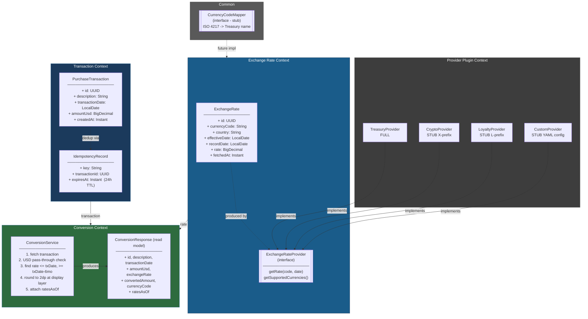
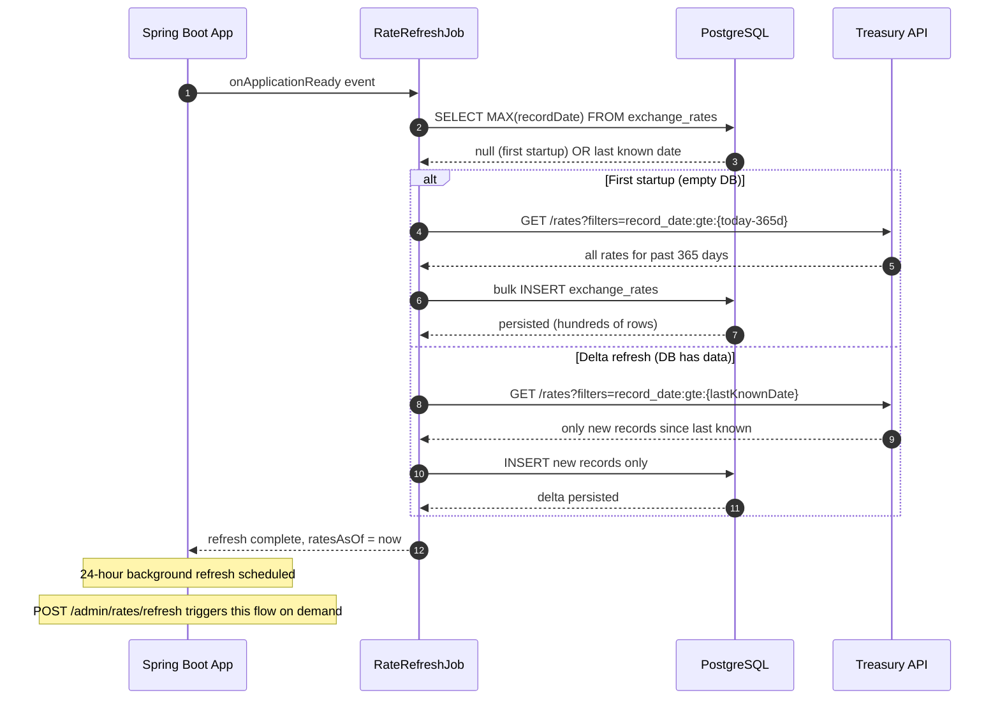
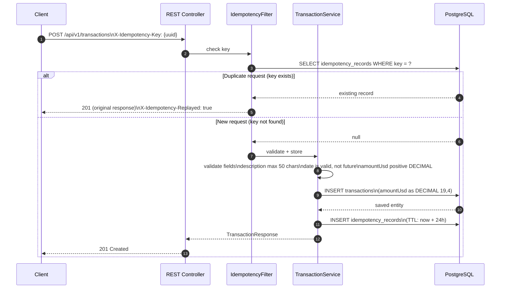
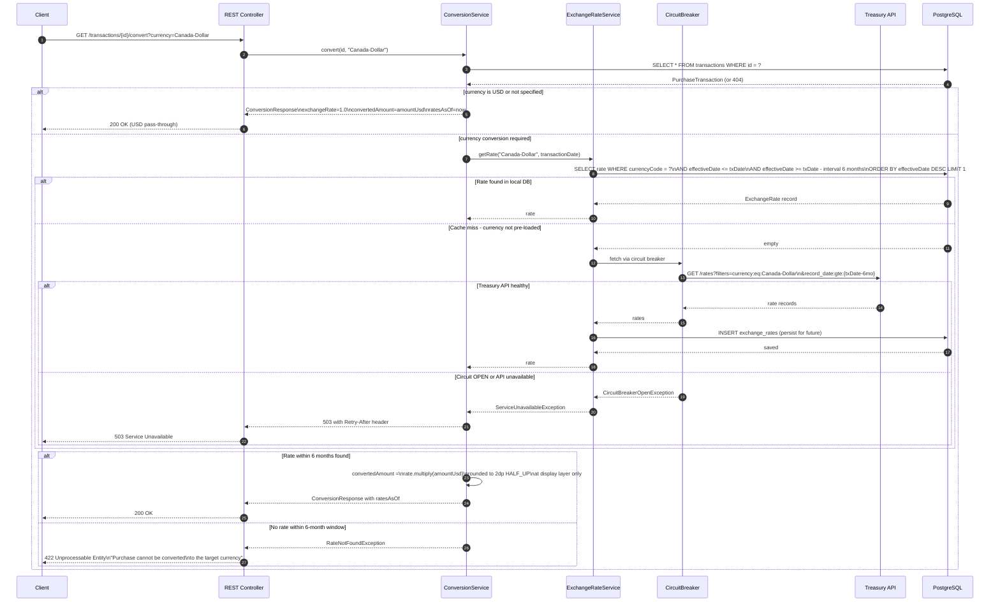
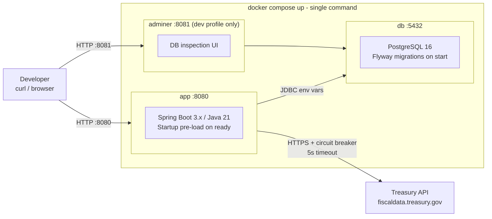
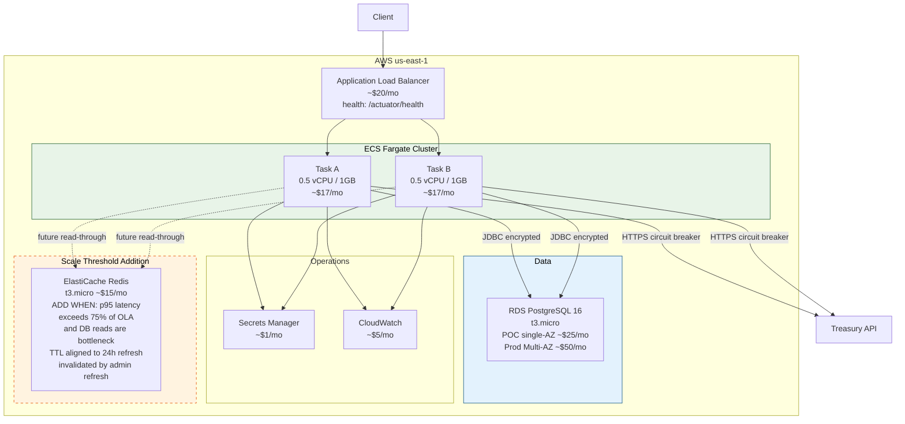
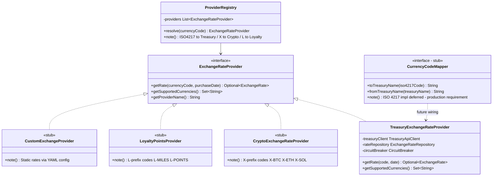
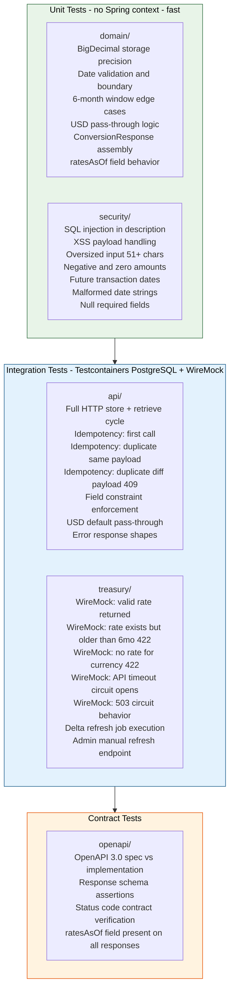

# CurrencyTransWEXlator - Architecture Diagrams

> Render in GitHub, GitLab, or any Mermaid-capable viewer.
> Place in `/docs/` or use as the repo README skeleton.

---

## 1. Domain-Driven Design - Bounded Contexts & Aggregates

---

## 2. Sequence - Application Startup Rate Pre-Load

---

## 3. Sequence - Store Transaction (with Idempotency)

---

## 4. Sequence - Retrieve and Convert Transaction

---

## 5. Deployment - Local (Docker Compose)

---

## 6. Deployment - Production AWS Reference

---

## 7. Provider Plugin Architecture

---

## 8. Test Category Architecture

